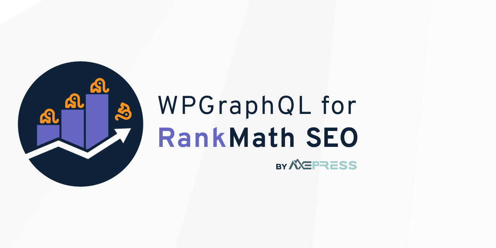

# WPGraphQL for Rank Math SEO

🚨 NOTE: This is prerelease software. 🚨

Adds WPGraphQL support for [Rank Math SEO](https://rankmath.com/). Built with [WPGraphQL Plugin Boilerplate](https://github.com/AxeWP/wp-graphql-boilerplate).

* [Join the WPGraphQL community on Slack.](https://join.slack.com/t/wp-graphql/shared_invite/zt-3vloo60z-PpJV2PFIwEathWDOxCTTLA)
* [Documentation](#usage)

-----

    <br />


[](https://coveralls.io/github/AxeWP/wp-graphql-rank-math?branch=develop)
-----

## System Requirements

* PHP 7.4+ || 8.0+ || 8.1+
* WordPress 5.4.1+
* WPGraphQL 1.8.1+
* RankMath SEO 1.0.90+

## Quick Install

1. Install & activate [WPGraphQL](https://www.wpgraphql.com/).
2. Install & activate [Rank Math SEO](https://rankmath.com/).
3. Download the [latest release](https://github.com/AxeWP/wp-graphql-rank-math/releases) `.zip` file, upload it to your WordPress install, and activate the plugin.

### With Composer
```console
composer require axepress/wp-graphql-rank-math
```

## Updating and Versioning

As we work towards a 1.0 Release, we will need to introduce **numerous** breaking changes. We will do our best to group multiple breaking changes together in a single release, to make it easier on developers to keep their projects up-to-date.

Until we hit v1.0, we're using a modified version of [SemVer](https://semver.org/), where:

* v0.**x**: "Major" releases. These releases introduce new features, and _may_ contain breaking changes to either the PHP API or the GraphQL schema
* v0.x.**y**: "Minor" releases. These releases introduce new features and enhancements and address bugs. They _do not_ contain breaking changes.
* v0.x.y.**z**: "Patch" releases. These releases are reserved for addressing issue with the previous release only.

## Development and Support

Development of WPGraphQL for Rank Math SEO is provided by [AxePress Development](https://axepress.dev). Community contributions are _welcome_ and **encouraged**.

Basic support is provided for free, both in [this repo](https://github.com/axewp/wp-graphql-rank-math/issues) and at the #rank-math channel in [WPGraphQL Slack](https://join.slack.com/t/wp-graphql/shared_invite/zt-3vloo60z-PpJV2PFIwEathWDOxCTTLA).

Priority support and custom development is available to [our Sponsors](https://github.com/sponsors/AxeWP).

<a href="https://github.com/sponsors/AxeWP" alt="GitHub Sponsors"></a>


## Supported Features

* [x] General Settings
* [x] Titles & Meta Settings
* [ ] 🏗 SEO data for
  * [x] Single posts, pages, attachments, and CPTs.
  * [x] Post Type archives.
  * [x] Categories, tags, and custom taxonomy terms.
  * [x] Authors (users)
  * [ ] Image attributes.
* [x] Sitemaps
* [ ] Redirections
* [ ] 404 Monitor
* [ ] Local SEO and Knowledgegraph
* [ ] RSS Feeds

### Supported SEO data

* [x] Full head
* [x] RankMath SEO Score
* [x] Basic Meta Attributes: Title, Description, Robots, Focus Keywords, Canonical URL,
* [x] Breadcrumbs
* [ ] 🏗 JSON-LD
  * [x] Raw schema
  * [ ] Individual JSON-LD attributes
* [x] OpenGraph & Twitter

## Usage

**Note** This is not a complete list of GraphQL fields and types added to the schema. Please refer to the WPGraph_i_QL IDE for more queries and their documentation.

### Querying Post Types

```graphql
query MyPosts {
  posts {
    nodes {
      databaseId
      title
      seo { # The SEO data for the current post object.
        breadcrumbs {
          title
          url
          isHidden
        }
        breadcrumbTitle
        canonicalUrl
        description
        focusKeywords
        fullHead
        jsonLd {
          raw
        }
        openGraph {
          articleMeta {
            section
          }
          description
          locale
          siteName
          title
          type
          url
          slackEnhancedData {
            data
            label
          }
          twitterMeta {
            card
            description
            title
          }
        }
        robots
        title
        ... on RankMathContentNodeSeo { # Only available on `contentNode` types.
          isPillarContent
          seoScore {
            badgeHtml
            hasFrontendScore
            rating
            score
          }
        }
      }
      author {
        node {
          seo { # The SEO Data for the post object's author.
            breadcrumbs {
              title
              url
              isHidden
            }
            breadcrumbTitle
            canonicalUrl
            description
            focusKeywords
            fullHead
            robots
            title
          }
        }
      }
      categories {
        nodes {
          name
          seo { # The SEO Data for the post's associated terms.
            breadcrumbs {
              title
              url
              isHidden
            }
            breadcrumbTitle
            canonicalUrl
            description
            focusKeywords
            fullHead
            jsonLd {
              raw
            }
            openGraph {
              locale
              siteName
              type
              url
              twitterMeta {
                card
              }
            }
            robots
            title
          }
        }
      }
    }
  }
}
```

### Querying Post Type Archives

``` graphql
{
  contentTypes {
    nodes {
      name
      seo { # The SEO data for the post type archive
        breadcrumbTitle
        canonicalUrl
        description
        focusKeywords
        fullHead
        jsonLd {
          raw
        }
        openGraph {
          locale
          siteName
          type
          url
          twitterMeta {
            card
          }
        }
        robots
        title
      }
      contentNodes {
        nodes {
          seo { # The SEO data for the associated posts.
            breadcrumbs {
              title
              url
              isHidden
            }
            breadcrumbTitle
            canonicalUrl
            description
            focusKeywords
            fullHead
            jsonLd {
              raw
            }
            openGraph {
              articleMeta {
                section
              }
              description
              locale
              siteName
              title
              type
              url
              slackEnhancedData {
                data
                label
              }
              twitterMeta {
                card
                description
                title
              }
            }
            robots
            title
            ... on RankMathContentNodeSeo { # Only available on `contentNode` types.
              isPillarContent
              seoScore {
                badgeHtml
                hasFrontendScore
                rating
                score
              }
            }
          }
        }
      }
    }
  }
}

```

### Querying Term Archives

```graphql
query MyCategories {
  categories {
    nodes {
      name
      seo { # The SEO data for the current term archive
        breadcrumbs {
          title
          url
          isHidden
        }
        breadcrumbTitle
        canonicalUrl
        description
        focusKeywords
        fullHead
        jsonLd {
          raw
        }
        openGraph {
          locale
          siteName
          type
          url
          twitterMeta {
            card
          }
        }
        robots
        title
      }
      contentNodes {
        nodes {
          databaseId
          title
          seo { ## The SEO data for the posts associated with this term.
            breadcrumbs {
              title
              url
              isHidden
            }
            breadcrumbTitle
            canonicalUrl
            description
            focusKeywords
            fullHead
            jsonLd {
              raw
            }
            openGraph {
              articleMeta {
                section
              }
              description
              locale
              siteName
              title
              type
              url
              slackEnhancedData {
                data
                label
              }
              twitterMeta {
                card
                description
                title
              }
            }
            robots
            title
            ... on RankMathContentNodeSeo { # Only available on `contentNode` types.
              isPillarContent
              seoScore {
                badgeHtml
                hasFrontendScore
                rating
                score
              }
            }
          }
        }
      }
    }
  }
}

```

### Querying Users

```graphql
{
  users {
    nodes {
      name
      seo { # The SEO data for the User profile page.
        breadcrumbs {
          title
          url
          isHidden
        }
        breadcrumbTitle
        canonicalUrl
        description
        focusKeywords
        fullHead
        jsonLd {
          raw
        }
        robots
        title
      }
    }
  }
}


```
### Querying with `nodeByUri`.

```graphql
query MyNodeByUriQuery( $uri: String ) {
  nodeByUri( uri: $uri ) {
    ... on NodeWithRankMathSeo {
      seo {
        breadcrumbs {
          title
          url
          isHidden
        }
        breadcrumbTitle
        canonicalUrl
        description
        focusKeywords
        fullHead
        jsonLd {
          raw
        }
        robots
        title
        ... on RankMathContentNodeSeo {
          isPillarContent
          seoScore {
            score
          }
        }
      }
    }
  }
}
```

### Querying Sitemaps

```graphql
{
  rankMathSettings {
    sitemap {
      author {
        excludedRoles
        excludedUserDatabaseIds
        sitemapUrl
        connectedAuthors {
          nodes {
            id
          }
        }
      }
      contentTypes {
        customImageMetaKeys
        isInSitemap
        sitemapUrl
        type
        connectedContentNodes {
          nodes {
            uri
          }
        }
      }
      general {
        canPingSearchEngines
        excludedPostDatabaseIds
        excludedTermDatabaseIds
        hasFeaturedImage
        hasImages
        linksPerSitemap
      }
      indexUrl
      taxonomies {
        hasEmptyTerms
        isInSitemap
        sitemapUrl
        type
        connectedAuthors {
          nodes {
            uri
          }
        }
      }
    }
  }
}

```

## Testing

1. Update your `.env` file to your testing environment specifications.
2. Run `composer install-test-env` to create the test environment.
3. Run your test suite with [Codeception](https://codeception.com/docs/02-GettingStarted#Running-Tests).
E.g. `vendor/bin/codecept run wpunit` will run all WPUnit tests.

## Credits

<a href="https://github.com/AxeWP/wp-graphql-plugin-boilerplate"></a>
