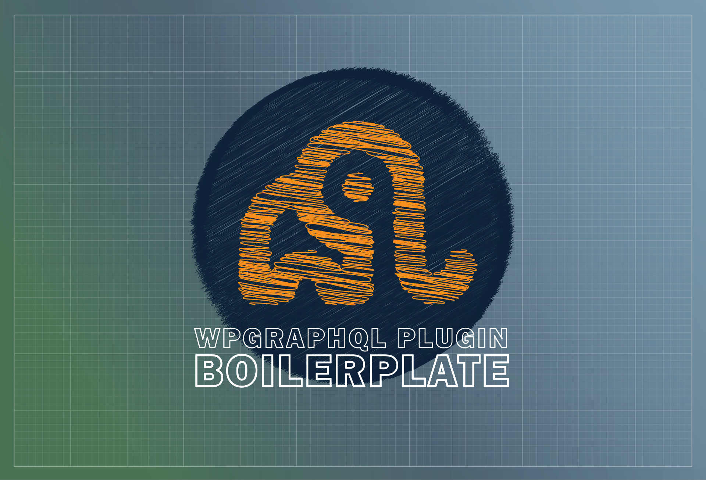

# WPGraphQL Plugin Boilerplate

🚨 NOTE: This is prerelease software. Use at your own risk 🚨

A boilerplate for creating WPGraphQL extensions.

* [Join the WPGraphQL community on Slack.](https://join.slack.com/t/wp-graphql/shared_invite/zt-3vloo60z-PpJV2PFIwEathWDOxCTTLA)

Inspired by the following projects and their contributors:

* [WPGraphQL](https://github.com/wp-graphql/wp-graphql)
* [WPGraphQL BuddyPress](https://github.com/wp-graphql/wp-graphql-buddypress)
* [WPGraphQL for GravityForms](https://github.com/harness-software/wp-graphql-gravity-forms)
* [WPGraphQL for WooCommerce](https://github.com/wp-graphql/wp-graphql-woocommerce)

## Features

* Default folder structure that mirrors WPGraphQL.
* Helper classes, interfaces, methods, and traits to make it easier to register new GraphQL types.
* Dependency management with [Composer](https://getcomposer.org/).
* Code sniffing with [PHPCS](https://github.com/squizlabs/PHP_CodeSniffer), [WordPress Coding Standards](https://developer.wordpress.org/coding-standards/wordpress-coding-standards/), and [Automattic's WordPress VIP Coding Standards](https://github.com/Automattic/VIP-Coding-Standards)
* Static Analysis with [PHPStan](https://phpstan.org/)
* WPUnit Testing with [Codeception](http://codeception.com/) and [WPBrowser](https://wpbrowser.wptestkit.dev/).
* [Docker](https://www.docker.com/) image generation.
* Automated CI with [Github Actions](https://github.com/features/actions).

## System Requirements

* PHP 7.4+ | 8.0
* WordPress 5.4.1+
* WPGraphQL 1.8.0+

## Getting Started

### 1. Initialize the plugin

Creating your WPGraphQL plugin is as simple as downloading the project to your machine and running `curl -fsSL https://raw.github.com/AxeWP/wp-graphql-plugin-boilerplate/master/bin/install.sh | bash`.

You will be asked to provide the following configuration details, or you can pass them as flags.

* **Branch (`--branch`)** : The Github branch to use as the source.
* **Name (`--name`)** : The name of your plugin (e.g. `My Plugin for WPGraphQL`).
* **Namespace (`--namespace`)**: The PHP namespace to be used for the plugin (e.g. `MyPlugin`).
* **Path (`--path`)**: The path to the directory directory where the plugin should be created (e.g. `mysite/wp-content/plugins`).
* **Prefix (`--prefix`)**: The plugin prefix (in snake case). This will be used to generate unique functions, hooks and constants (e.g. `my_plugin`).
* **Slug (`--slug`)**: The slug (in kebab-case) to use for the plugin (e.g. `wp-graphql-my-plugin`).

Alternatively, you can download the repository and run `composer create-plugin`.

### 2. Create your `.env` file

Rename `.env.dist` to `.env`, and set the variables to your particular localhost/testing environment.

## Project Structure

```properties

wp-graphql-plugin-name                # This will be renamed by `create-plugin` to the provided slug.
├── .github/workflows
│   ├── code-quality.yml              # Github workflow for PHPStan.
│   ├── code-standard.yml             # Github workflow for PHPCS
│   ├── integration-testing.yml       # Github workflow for Codeception tests and Coveralls.
│   ├── schema-linter.yml             # Github workflow GraphQL schema linting.
│   └── upload-schema-artifact.yml    # Generates a schema artifact on Github release, for use by schema-linter.yml
├── .wordpress.org                    # Assets for use in WordPress's plugin directory.
├── bin
│   ├── _env.sh                       # The shared env variables used by other shell scripts.
│   ├── _lib.sh                       # Shared functions used by other shell scripts
│   ├── install-stan-env.sh           # Creates a development environment for running PHPStan.
│   ├── install-test-env.sh           # Creates a development environment for running Codeception.
│   ├── run-docker.sh                 # Builds and runs the Docker image.
│   └── wp-cli.yml                    # WPCLI configuration used for scripts.
├── docker
│   ├── app.Dockerfile
│   ├── app.entrypoint.sh
│   ├── app.post-setup.sh
│   ├── app.setup.sh
│   ├── testing.Dockerfile
│   └── testing.entrypoint.sh
├── phpstan
│   └── constants.php                 # Stubbed plugin constants for PHPStan.
├── src
│   ├── Admin                         # Classes for modifying the WP dashboard.
│   │   └── Settings
│   │       └── Settings.php          # Adds custom settings to WPGraphQL's settings page.
│   ├── Connection                    # GraphQL connections.
│   ├── Data
│   ├── Fields                        # Individual GraphQL fields.
│   ├── Model                         # GraphQL object data modelers.
│   ├── Mutation                      # GraphQL mutations
│   ├── Type                          # GraphQL types.
│   │   ├── Enum                      # Enum types.
│   │   ├── Input                     # Input types.
│   │   ├── Union                     # Union types.
│   │   ├── WPInterface               # Interface types.
│   │   └── WPObject                  # Object types.
│   ├── Utils                         # Helper functions used across the plugin
│   ├── CoreSchemaFilters.php         # Entrypoint for modifying the default schema provided by WPGraphQL
│   ├── Main.php                      # Bootstraps the plugin
│   └── TypeRegistry.php              # Entrypoint for registering GraphQL types to the schema
├── tests                             # Codeception tests
│   ├── _data
│   ├── _envs
│   ├── _output
│   ├── _support
│   ├── acceptance
│   ├── unit
│   ├── wpunit
│   ├── acceptance.suite.dist.yml
│   ├── bootstrap.php
│   ├── unit.suite.dist.yml
│   └── wpunit.suite.dist.yml
├── .distignore
├── .env.dist
├── .gitattributes
├── .gitignore
├── .phpcs.xml.dist
├── access-functions.php              # Globally-available functions for accessing class methods.
├── activation.php                    # Methods that run on plugin activation.
├── codeception.dist.yml
├── composer.json
├── deactivation.php                  # Methods that run on plugin deactivation.
├── docker-compose.yml
├── LICENSE
├── phpstan.neon.dist
├── phpunit.xml.dist
├── README.md                         # The repo readme file.
├── readme.txt                        # The plugin readme file.
└── wp-graphql-plugin-name.php
```

## Roadmap

* Include example files.
* Quality-of-life utils that make it easy to extend WPGraphQL.
* Extensive documentation.

## Documentation

@todo

### Recipes

@todo
